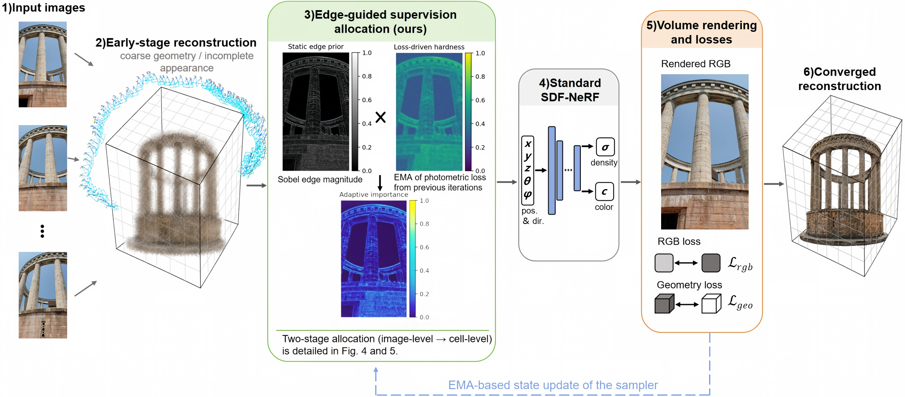

# EGSA: Edge-Guided Supervision Allocation for Neural Surface Reconstruction in Architectural Scenes

EGSA redistributes a fixed ray budget using image-space edges and
EMA-smoothed photometric error. It changes supervision sampling while retaining
the SDF-based neural representation, rendering model and per-ray training losses.



*Framework overview from the paper. The network panel is schematic: SDF-based
backbones obtain rendering density or opacity from a signed-distance field.
The figure's numbered references refer to figures in the paper.*

## Installation

This repository includes the SDFStudio training source with EGSA integrated;
a separate SDFStudio checkout or overlay step is not required. See
[installation](docs/INSTALLATION.md) for the CUDA environment and dependencies.

```powershell
git clone https://github.com/Roy233333/EGSA-release.git
cd EGSA-release
# Run after preparing the CUDA/PyTorch environment described in the guide.
python -m pip install -c constraints-tested.txt -e .
python scripts/check_environment.py --require-cuda
```

## Training

Start from a working SDFStudio training command, using this repository's
EGSA-integrated code installed as described above. Add the following EGSA
options before the data-parser subcommand (e.g. `sdfstudio-data`). These are
arguments to insert into your existing command, not a standalone command:

```text
--pipeline.datamanager.sampler-type adaptive
--pipeline.datamanager.adaptive-edge-type sobel
--pipeline.datamanager.adaptive-edge-weight 1.3
--pipeline.datamanager.adaptive-uniform-mix 0.6
--pipeline.datamanager.adaptive-ema-decay 0.9
--pipeline.datamanager.adaptive-hardness-enabled True
--pipeline.datamanager.adaptive-block-size 8
--pipeline.datamanager.adaptive-blockwise-exact False
```

Keep your existing backbone, dataset path, ray budget, training schedule and
other settings unchanged when comparing against uniform sampling. The
unmodified upstream SDFStudio code does not recognise these EGSA options.
See [training options](docs/TRAINING.md) for sampler variants and dataset settings.

## Data and ground truth

Downloads are distributed as ZIP assets in
[Releases](https://github.com/Roy233333/EGSA-release/releases).
Training archives contain RGB images and camera metadata. Monocular depth/normal
priors generated with Omnidata v2 are not distributed; see the
[data guide](docs/DATASETS.md#monocular-priors) if your experiment requires them.

| Training data | Images | Resolution | Geometry reference |
|---|---:|---|---|
| Scene1 | 328 | 384 × 384 | Scene1-GT |
| Scene1-HR | 328 | 1280 × 720 | Same physical scene; not a separate calibrated GT package |
| Scene2 / Doss Trento | 380 | 384 × 384 | Scene2-GT |
| Scene3 | 157 | 384 × 384 | Scene3-GT: full and filtered building-only versions |
| Scene4 | 514 | 1920 × 1080 | Not supplied |

See [data contents, preprocessing and terms](docs/DATASETS.md). GT refers to
reference point clouds, not a table of reported reconstruction scores.

## Evaluation

### Image quality

SDFStudio computes PSNR, SSIM and LPIPS and supports W&B logging through
`--vis wandb`. Run `wandb login` once before using W&B. View and compare the logged metrics
in W&B, using matched evaluation views, training steps and aggregation settings.
Use `--vis tensorboard` instead if W&B is not needed.

### Geometry accuracy

Compare reconstructed geometry with the supplied LiDAR references after
preprocessing, alignment and overlap filtering. Report Chamfer Distance, Median
and P95 according to the paper's **Evaluation Protocol — Geometric Accuracy**
section, which provides the detailed procedure and metric definitions.

## Code layout

```text
nerfstudio/          SDFStudio models, rendering, training and EGSA integration
scripts/            Training, upstream image evaluation, rendering and mesh extraction
assets/             Framework figure
docs/               Installation, training, data and evaluation notes
tests/              EGSA numerical and data-integrity tests
dataset_manifests/  SHA-256 file and ZIP checksums
```

## Citation and licence

Please cite the paper when using EGSA; author and title information is in
[CITATION.cff](CITATION.cff). Code is Apache-2.0; upstream attribution is retained
in [NOTICE](NOTICE). Dataset terms are separate, including the NeRFBK source
attribution for Scene2. See [dataset terms](docs/DATASETS.md#dataset-terms).
